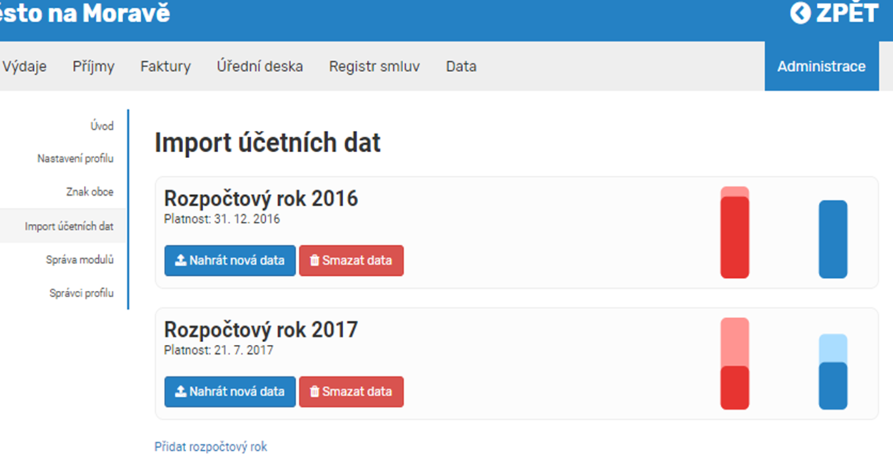
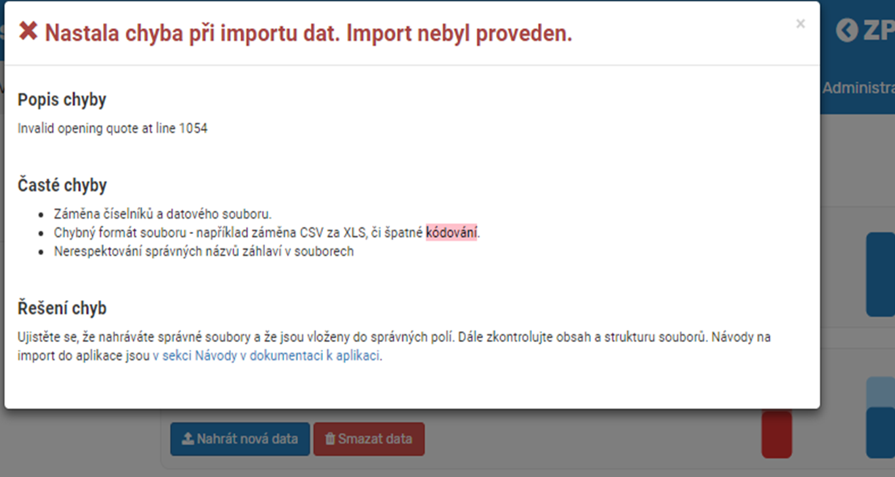

# Import dat

Po kliknutí na import dat se objeví možnost nahrát nová data, nebo, pokud tam již nějaká data nahraná jsou, možnost nahrát nebo smazat data v daném roce.

Nahrát nová data- Pro nahrání nových dat použijte tlačítko Nahrát nová data. 

Smazat data- Pokud chcete nahraná data smazat, použijte tlačítko Smazat data. Po kliknutí na toto tlačítko svou volbu musíte potvrdit opětovným kliknutím na tlačítko Smazat. 

Přidat rozpočtový rok- Pro přidání nového rozpočtového roku klikněte na toto tlačítko. Poté se Vám objeví řádek, do kterého vyplníte název roku (např. 2016,2017). Nahrávání účetních dat se Vám objeví vždy, když zapisujete nový rozpočtový rok, nebo aktualizujete ten současný. 

Datum platnosti- Od kdy platí vložená data. 

Poznámka- Do tohoto řádku můžete napsat poznámku k datům. 

Nahrát- Kliknutím na tento odkaz nahrajete Vámi vyplněná data

Struktura dat je popsána https://otevrena-data-mfcr.github.io/CityVizor/data/.Data v jiné struktuře nebude možné nahrát. V případě, že nahrajete data v chybné struktuře nebo v odlišném formátu, zobrazí se vám chybová hláška. 

