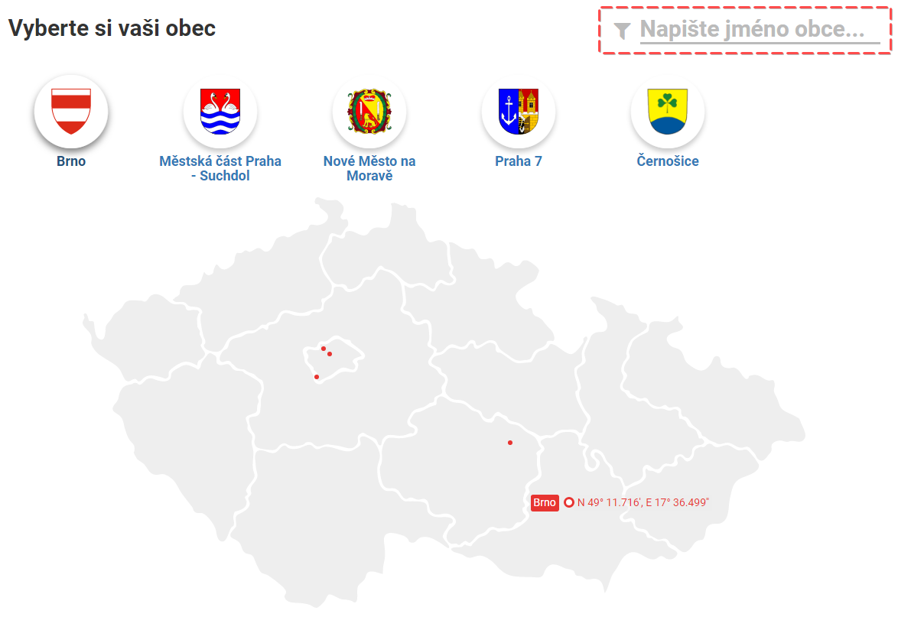

* TOC
{:toc}

### Vyhledání obce
Pro vyhledání údajů o obci, která Vás zajímá stačí zadat do vyhledávání jméno obce nebo ji najít na mapě. Poté se můžete prokliknout do modulu dané obce. 

### Aktuálně
Na stránce aktuálně se zobrazují nejnovější uhrazené faktury a smlouvy a je možné se dále prokliknout do většího detailu jednotlivých smluv.

### Výdaje
Ve výdajích se můžete podívat na konkrétní výdaje podle účelu s detailem do jednotlivých faktur. Je tedy vidět jaké částky jsou za konkrétní akci/projekt vynakládány a případně jakému dodavateli. Pro jednodušší orientaci jsou výdaje sloučené do výdajových skupin. Struktura a dělení vychází z členění rozpočtu podle paragrafů a rozpočtových položek. 
Po kliknutí na modul Výdaje se Vám zobrazí graf, který ukazuje naplánovaný rozpočet (světle modrá) a čerpání (tmavě modrá). Velikost jednotlivé kapitoly rozpočtu (jednotlivého prstence grafu) je velká dle obsahu peněz v dané kapitole rozpočtu. V levém horním rohu lze sledovat celkové čerpání v daném rozpočtovém roce. Po kliknutí na Seznam se Vám zobrazí jednotlivé kapitoly výdajů, i s jejím plněním.
Po kliknutí na výběr skupin rozpočtu se Vám otevře seznam i se zmenšeným grafem plnění rozpočtu. (nalevo do jednotlivé kapitoly rozpočtu).
Poté je možné se prokliknout na konkrétní akci/projekt, kde jsou informace o výdajích, fakturách (příjmových i výdajových), příjmech a celkového srovnání vztahující se k té akci/projektu.

### Příjmy
V příjmech naleznete informace o celkových usktuečněných a plánovaných příjmech členěných do skupin jejichž struktura vychází z rozpočtového členění. Po výběru skupiny se vám zobrazí nabídka příjmových položek. Po kliknutí na konkrétní akci/projekt se zobrazí podrobné informace ve stejné podobě jako v modulu výdaje.

### Úřední deska
Na úřední desce jsou veřejně přístupné právní předpisy, rozhodnutí a jiné dokumenty správních orgánů a soudů. S pomocí úřední desky se můžete například dozvědět, že se plánuje uzavírka důležité komunikace, obec zrovna výhodně prodává pozemky nebo probíhá stavební řízení na nový supermarket. Cityvizor využívá data z aplikace edesky.cz, která harvestuje data z jednotlivých úředních desek. 
Webové stránky mají podobu mapy, zahrnující danou obec, v níž jsou barevně vyznačeny nemovitosti či parcely, které jsou zmíněny v dokumentech měst a dochází tak u nich k nějakým změnám (prodej, pronájem, opravy atd.). Kliknutím na konkrétní zvýrazněný objekt se otevře příslušný dokument radnice, v němž se o vámi vybraném objektu jedná. Rychle a jednoduše tak najdete informaci, která vás zajímá. 

### Registr smluv
V Cityvizor kopíruje data z registru smluv, který je zřízen dle Zákona o registru smluv (předpis č. 340/2015 Sb.). Prokliknutím se možné se dostat do detailu jednotlivých smluv přímo v samotném registru. 

## Správa profilu

### Přihlášení pro obce
Po otevření úvodní stránky srolujte pomocí myši na konec stránky a klikněte na přihlásit se. 
Poté se vám zobrazí přihlašovací formulář. Zde zadejte přihlašovací jméno (email) a heslo. Přihlašovací údaje Vám byly přiděleny správcem. Pokud nemáte údaje nebo přihlášení nefunguje, nebo jste zapomněli heslo, kontaktujte podporu na adrese cityvizor@otevrenamesta.cz. 

### Nastavení profilu
Pokud si chcete nastavit Váš profil, tedy změnit své uživatelské údaje, klikněte na tlačítko nastavení, které se nachází v pravém dolním rohu stránky. 

### Prostředí pro obce
Po otevření úvodní stránky (modul- Aktuálně) na profilu Vámi hledaného města klikněte na odkaz nastavení. Tento odkaz se nachází v pravém horním rohu stránky. Ve správě profilu se Vám jako první objeví obsah odkazu Úvod. Zde jsou Vám představeny funkce Správy profilu a odkaz na Návody k aplikaci. 

#### Nastavení profilu
Po kliknutí na tento odkaz se Vám objeví informace o dané obce nebo městě, zde se dají informace upravovat. Po otevření nastavení profilu lze vyplnit nebo změnit informace o daném městě. 

Adresa/URL- V tomto řádku lze změnit koncovku URL adresy, která bude odkazovat na profil Vámi spravovaného města. 

Identifikace obce- V tomto řádku je za potřebí vyplnit identifikační čísla obce ve státních registrech (IČO,ZÚJ). 

Úřední deska- V tomto řádku je za potřebí vyplnit kody Vámi spravovaných měst v aplikacích eDesky a MapaSamosprávy. Kod Vámi spravovaného města naleznete v URL adrese. Pro získání správné URL adresy stačí najít dané město na stránkách edesky.cz 

Poloha Vaší obce- V tomto řádku je za potřebí vyplnit GPS polohu Vámi spravovaného města. Kontaktní mail- Na tomto řádku se nachází email na správce Vašeho profilu, kterého můžete kontaktovat v případě dotazu či problému s Vaším profilem. 
Možnost viditelnosti- Zde si Zvolíte, zda budou informace, které jste vyplnili do nastavení profilu viditelné pro návštěvníky webu. 

Po vyplnění všech řádků klikněte na Uložit změny. V případě potřeby změny Vámi vyplněných údajů, údaje změňte a potvďte kliknutím na Uložit změny.

#### Import účetních dat
Po kliknutí na tento odkaz se Vám objeví rozpočtové roky. Zde můžete nahrávat nová data, měnit a mazat data již nahraná.

Nahrát nová data- Pro nahrání nových dat použijte tlačítko Nahrát nová data. Smazat data- Pokud chcete nahraná data smazat, použijte tlačítko Smazat data. Po kliknutí na toto tlačítko svou volbu musíte potvrdit opětovným kliknutím na tlačítko Smazat. Přidat rozpočtový rok- Pro přidání nového rozpočtového roku klikněte na toto tlačítko. Poté se Vám objeví řádek, do kterého vyplníte název roku (např. 2016,2017).  Nahrávání účetních dat se Vám objeví vždy, když zapisujete nový rozpočtový rok, nebo aktualizujete ten současný. Datum platnosti- Od kdy platí vložená data. Poznámka- Do tohoto řádku můžete napsat poznámku k datům. Nahrát- Kliknutím na tento odkaz nahrajete Vámi vyplněná data

#### Správa modulů
Po kliknutí na tento odkaz se Vám objeví moduly Vašeho města. Zde je můžete vypínat a zapínat, tedy zviditelnit pro návštěvníky webu či nikoliv. 

#### Správci profilu
Po kliknutí na tento odkaz se Vám objeví seznam správců Vámi spravovaného města včetně kontaktu.

### Změna údajů
Pro změnu Vašeho jména, nebo organizace klikněte do daného řádku a Vaše údaje nahraďte (přepište) novými. Změnu potvrďte kliknutím na tlačítko Uložit změny
Pro změnu hesla zadejte do řádku Heslo Vaše nové heslo. Poté heslo potvrďte opětovným zadáním hesla do kolonky Heslo znovu. Změnu potvrďte kliknutím na tlačítko Nastavit heslo.

#### ID eDesky a MapaSamospravy.cz

Číslo (ID) vaší obce najdete buď v [seznamu ID obcí](seznam-ID-obci.md), nebo kontaktujte správce webů [eDesky.cz](https://edesky.cz) a [MapaSamospravy.cz](https://mapasamospravy.cz).

