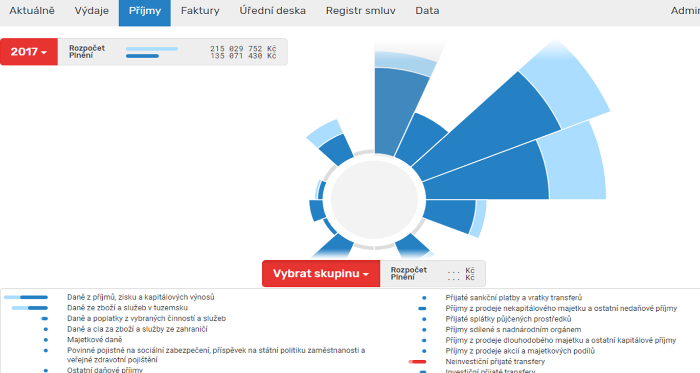

V příjmech naleznete informace o celkových usktuečněných a plánovaných příjmech členěných do skupin jejichž struktura vychází z rozpočtového členění. Po výběru skupiny se vám zobrazí nabídka příjmových položek. Po kliknutí na konkrétní akci/projekt se zobrazí podrobné informace ve stejné podobě jako v modulu výdaje.

