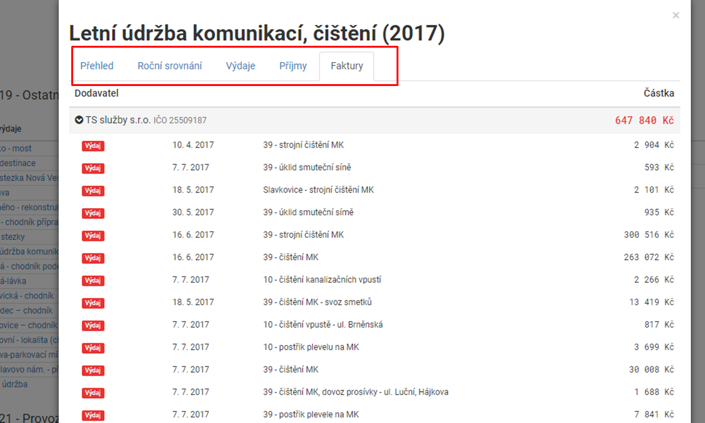

Ve výdajích se můžete podívat na konkrétní výdaje podle účelu s detailem do jednotlivých faktur. Je tedy vidět jaké částky jsou za konkrétní akci/projekt vynakládány a případně jakému dodavateli. Pro jednodušší orientaci jsou výdaje sloučené do výdajových skupin. Struktura a dělení vychází z členění rozpočtu podle paragrafů a rozpočtových položek. Po kliknutí na modul Výdaje se Vám zobrazí graf, který ukazuje naplánovaný rozpočet (světle modrá) a čerpání (tmavě modrá). Velikost jednotlivé kapitoly rozpočtu (jednotlivého prstence grafu) je velká dle obsahu peněz v dané kapitole rozpočtu. V levém horním rohu lze sledovat celkové čerpání v daném rozpočtovém roce. 

Po kliknutí na výběr skupin rozpočtu se Vám otevře seznam i se zmenšeným grafem plnění rozpočtu. (nalevo do jednotlivé kapitoly rozpočtu).

Poté je možné se prokliknout na konkrétní akci/projekt, kde jsou informace o výdajích, fakturách (příjmových i výdajových), příjmech a celkového srovnání vztahující se k té akci/projektu.

