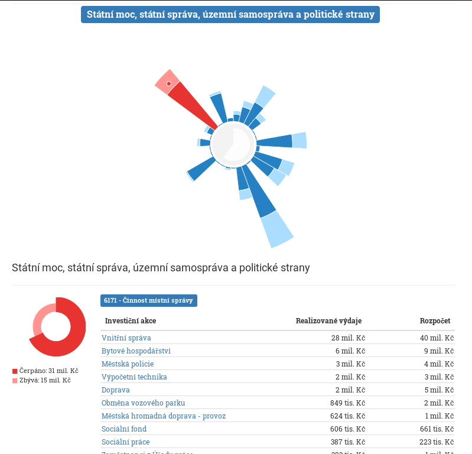

# Supervizor Plus

Přehledný rozklikávací rozpočet s plněním na jednotlivé faktury a dalšími funkcemi pro samosprávy:

- rozpočet (celkový přehled, projekty)
- plnění rozpočtu (výdaje po dodavatelích, výdaje po projektech, jednotlivé faktury)
- úřední deska (za pomoci [MapaSamosprávy.cz](http://www.mapasamospravy.cz/)
- [Otevřená Města](http://www.otevrenamesta.cz/) vám poskytují tuto aplikaci jako službu

Data jsou čerpána z otevřených dat (opendat) dané obce či samosprávy.

## Ukázka

Celkový pohled na výdaje samosprávy:


Podrobný pohled na ...:




## Instalace

**Potřebné balíčky**

Ubuntu: `sudo apt-get install mongodb`

Fedora 24: `sudo dnf install mongodb mongodb-server-3.2.8-2`

**Instalace**

Instalace node_modules a následná kompilace komponent pomocí ahead-of-time compileru, kompilace Typescriptu a rollup pro zmenšení kódu a spojení do jednoho balíčku.
```
npm install
npm run build
```

**Spuštění**

Start node serveru na portu 80 pro zkompilovaný kód
```
npm start
```

**Vývoj**

Start Typescript kompilátoru s volbou `--watch` a node serveru na portu 80 pro just-in-time compiler (kompilace komponent na klientu). Server se zrestartuje a Typescript překompiluje při jakékoliv změně kódu.
```
npm run dev
```
