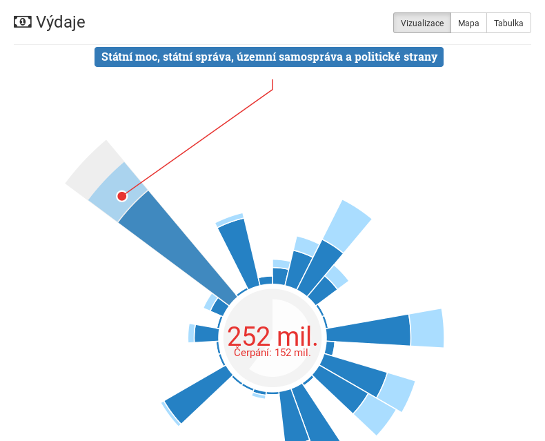

# CityVizor

Přehledný rozklikávací rozpočet s plněním na jednotlivé faktury a dalšími funkcemi pro samosprávy:

- rozpočet (celkový přehled, projekty)
- plnění rozpočtu (výdaje po dodavatelích, výdaje po projektech, jednotlivé faktury)
- úřední deska (za pomoci [MapaSamosprávy.cz](http://www.mapasamospravy.cz/)
- [Otevřená Města](http://www.otevrenamesta.cz/) vám poskytují tuto aplikaci jako službu

Data jsou čerpána z otevřených dat (opendat) dané obce či samosprávy.

## Ukázka

Celkový pohled na výdaje samosprávy:



Podrobný pohled na ...:


## Instalace

**Potřebné balíčky pro instalaci a běh**

- MongoDB
- NodeJS

**Instalace**

Instalace závislostí

```
npm install
```

Spuštění serveru

```
npm start
```

**Instalace serveru jako služby**

Instalace:
```
npm install -g forever forever-service
sudo forever-service install cityvizor -s server/server.js
```

Spuštění/vypnutí/restart
```
sudo service cityvizor start
sudo service cityvizor stop
sudo service cityvizor restart
```

Sledování logu
```
npm run logu
```
      

**Vývoj**

Start Typescript kompilátoru s volbou `--watch` a node serveru na portu 80 pro just-in-time compiler (kompilace komponent na klientu). Server se zrestartuje a Typescript překompiluje při jakékoliv změně kódu.
```
npm run dev
```
